# 🤖 机器学习方向：聚类 + 树模型（无 SHAP 依赖版）

数据源：`DMS001_enriched.csv`

说明：当前环境未安装 `shap / xgboost / lightgbm`，树模型解释采用：Permutation Importance + PDP（部分依赖图）。

## 1) 无监督聚类（按博主聚合均值）

- 方法：KMeans(k=4) + 层次聚类（Ward）+ PCA(2D)
- KMeans silhouette = 0.1996

- 产出：`creator_clusters.csv`（每个博主的集群归属）
- 产出：`cluster_profile.csv`（各集群画像均值）

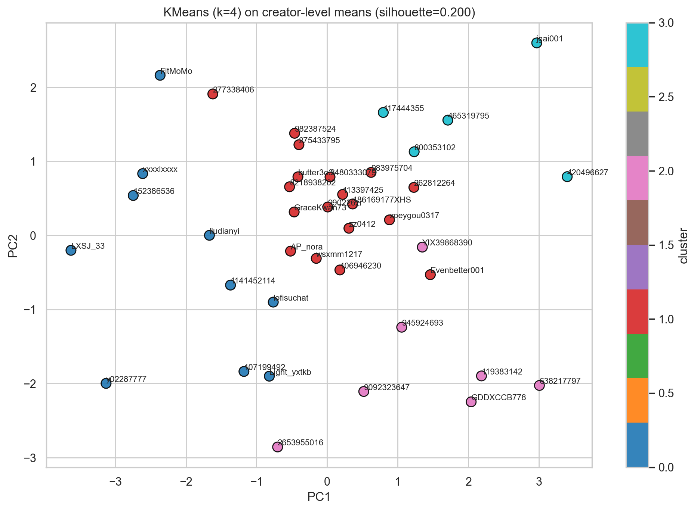

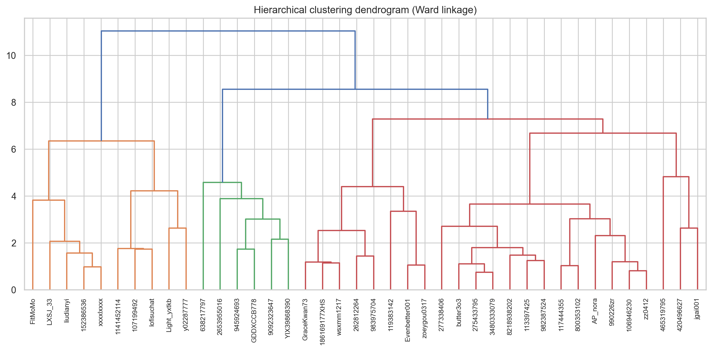

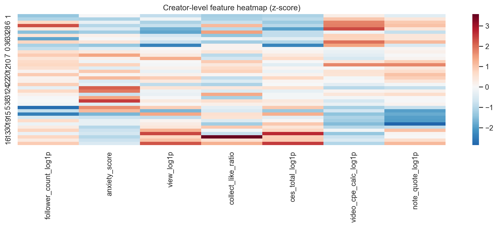

## 2) DBSCAN 异常值检测（按笔记）

- 产出：`dbscan_outliers_notes.csv`（DBSCAN 标记为 outlier 的笔记）

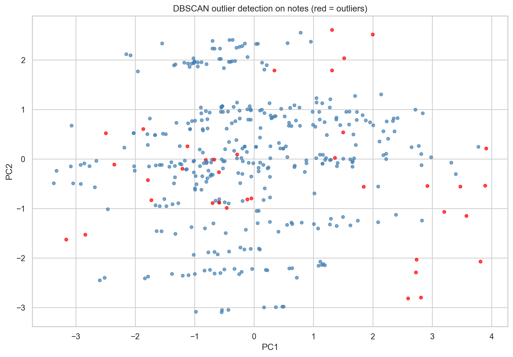

## 3) 树模型预测 + 可解释性（无 SHAP 依赖版）

- 产出：`ml_model_summary.csv`（各任务模型 R2 汇总）

### 任务 A：预测 view（ln(view+1)）

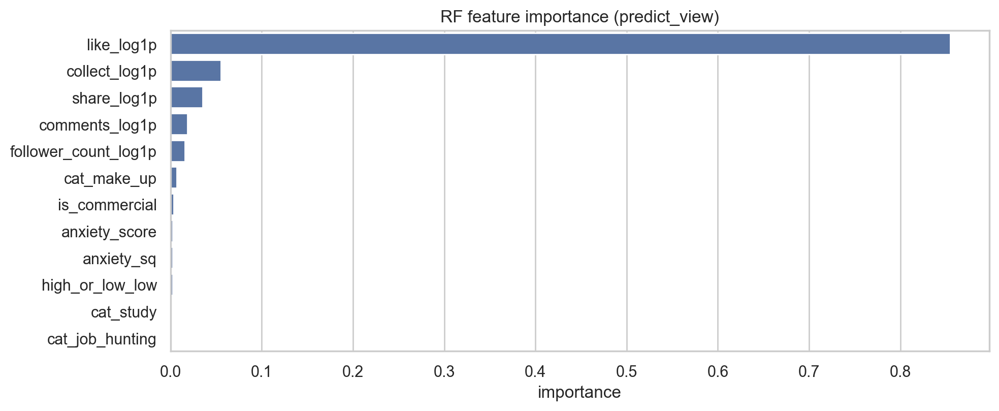

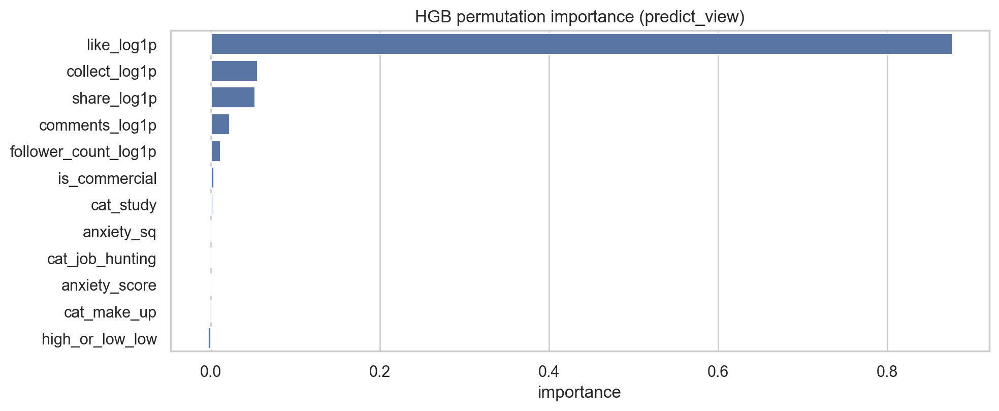

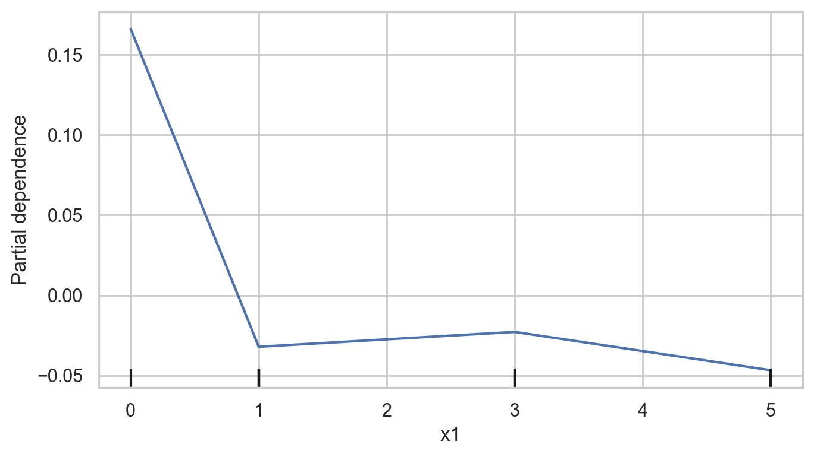

### 任务 B：预测 CES 总分（ln(ces_total+1)）

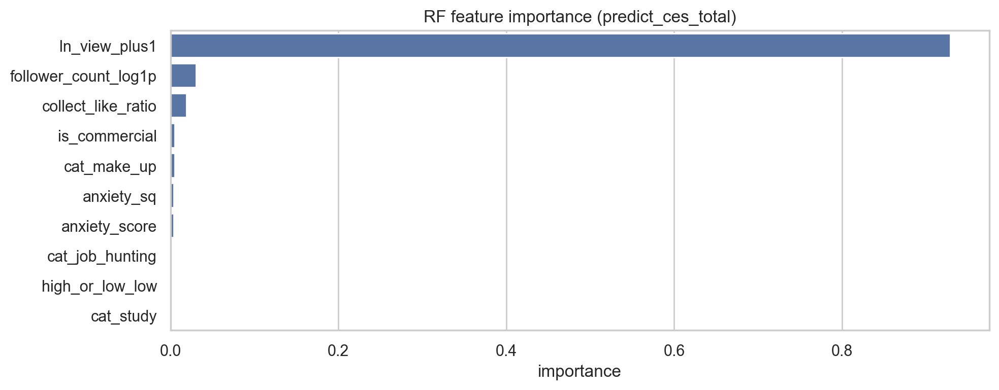

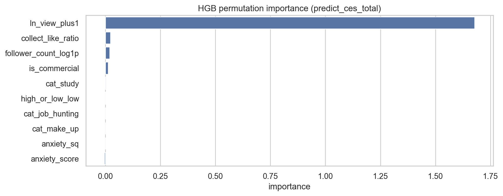

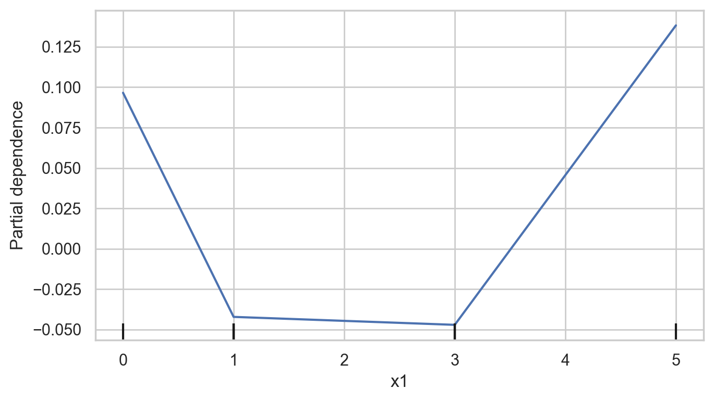

### 任务 C：预测视频 CPE（ln(video_cpe_calc+1)）

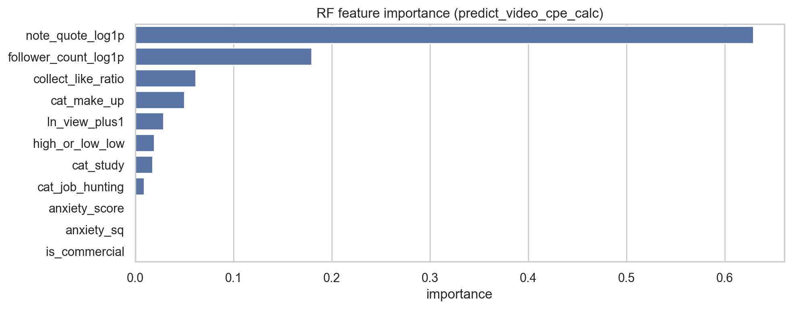

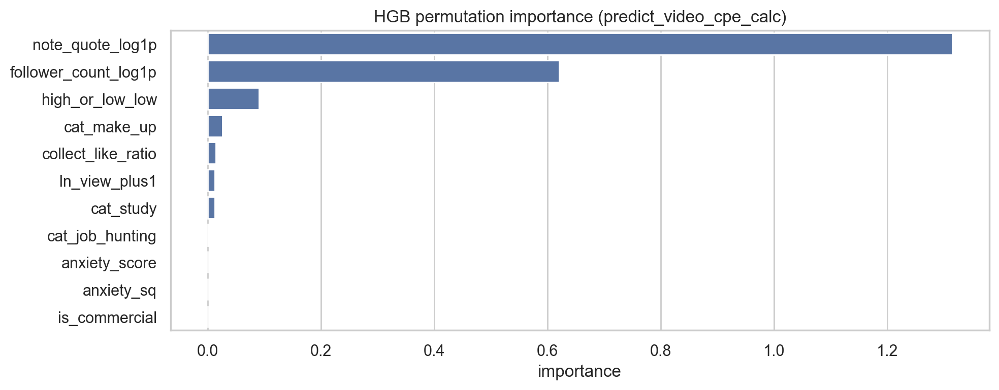

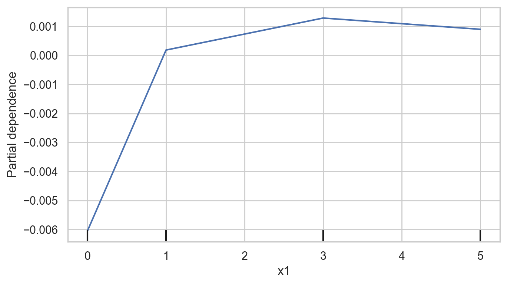

