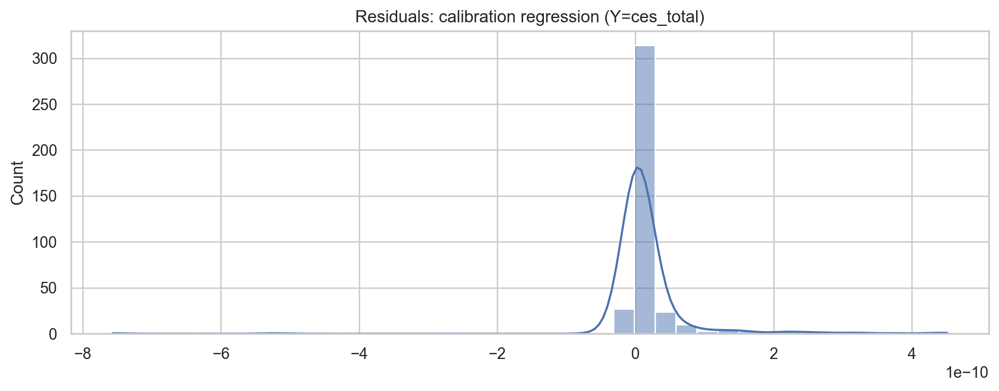
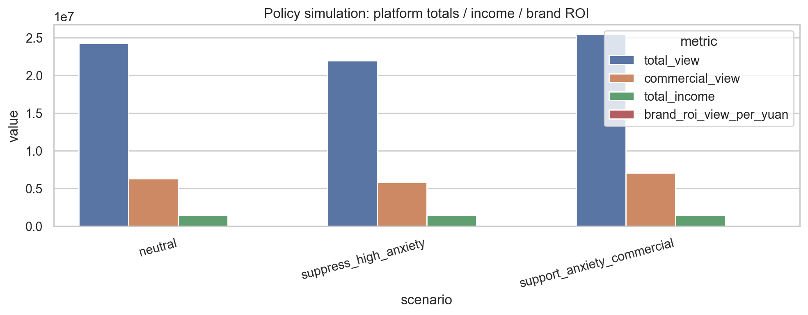
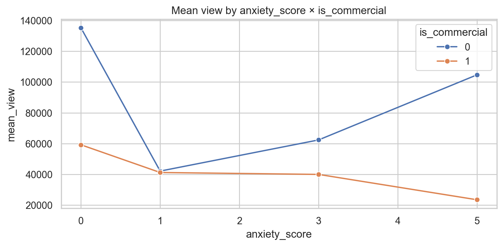
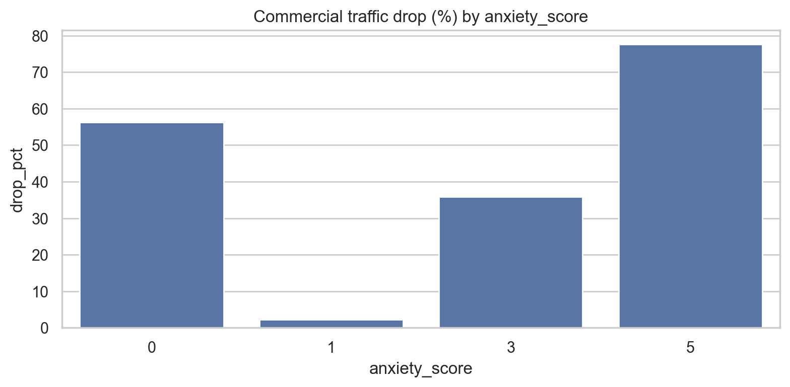

# 📱 平台算法 & 策略视角

数据源：`DMS001_enriched.csv`

## 1) 反向校准 CES 权重（回归拟合）

回归：`ces_total ~ like + collect + comments + share + (like/collect/comments/share)×high_anxiety_flag + is_commercial`

- 产出：`ces_weight_calibration.csv`
- N=400, K=10, df_resid=390, R2=1.000000

## 2) 平台限流策略博弈仿真

- 产出：`policy_simulation.csv`

## 3) 博主最优内容配比策略（0/1/3/5 焦虑占比网格搜索）

配比格式：`p0/p1/p3/p5`（四个比例之和为 1）

- 产出：`optimal_mix_by_koc.csv`（每个博主最大化 view / 收入 的最优配比）

## 4) 商业化流量折损（按焦虑档位）

- 产出：`commercial_drop_by_anxiety.csv`

