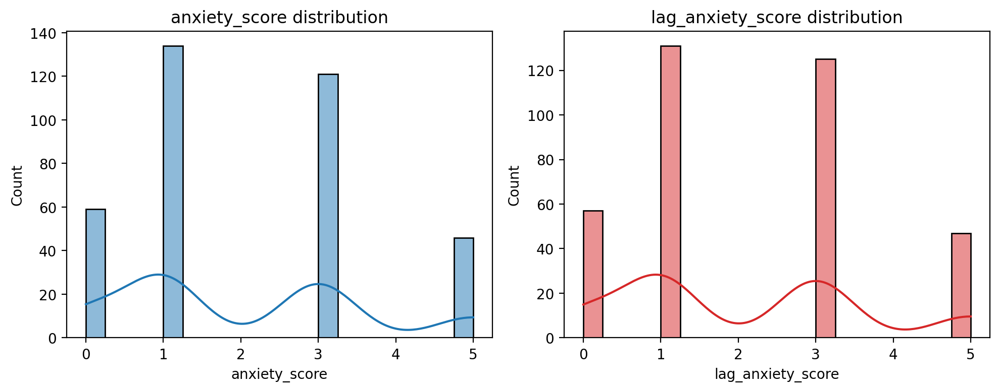
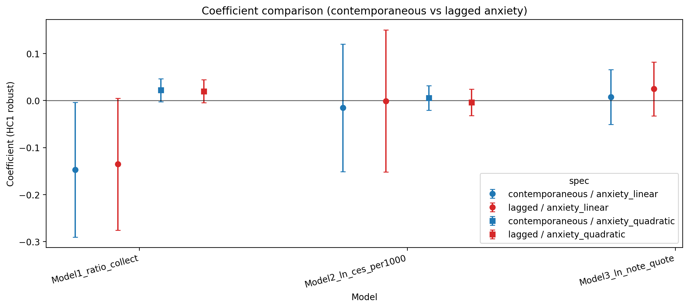

# 滞后焦虑稳健性检验（处理反向因果）

思路：按 koc_id 将上一条笔记的焦虑得分作为解释变量（lag_anxiety_score），并加入平方项（lag_anxiety_sq），以缓解“查看后台数据后刻意发布焦虑内容”带来的反向因果。

数据源：`DMS001_enriched.csv`

标准误：White robust (HC1)

## 模型设定（保持原框架，对比当期 vs 滞后焦虑）

- Model 1: `ratio_collect ~ anxiety_score + anxiety_sq + is_commercial` vs `ratio_collect ~ lag_anxiety_score + lag_anxiety_sq + is_commercial`
- Model 2: `ln_ces_per1000 ~ anxiety_score + anxiety_sq + is_commercial + C(high_or_low)` vs `ln_ces_per1000 ~ lag_anxiety_score + lag_anxiety_sq + is_commercial + C(high_or_low)`
- Model 3: `ln_note_quote ~ anxiety_score + ln_view_plus1 + is_commercial` vs `ln_note_quote ~ lag_anxiety_score + ln_view_plus1 + is_commercial`

## 数据诊断（焦虑与滞后焦虑）

- Pair N (anxiety & lag): 360
- Corr(anxiety_score, lag_anxiety_score): 0.2569

## 关键系数对比图

## 回归摘要

### Model1_ratio_collect / contemporaneous

- N=360, R2=0.034584, Adj.R2=0.026448
- Coef table: `Model1_ratio_collect_contemporaneous_coef.csv`

### Model1_ratio_collect / lagged

- N=360, R2=0.031887, Adj.R2=0.023729
- Coef table: `Model1_ratio_collect_lagged_coef.csv`

### Model2_ln_ces_per1000 / contemporaneous

- N=360, R2=0.009548, Adj.R2=-0.001612
- Coef table: `Model2_ln_ces_per1000_contemporaneous_coef.csv`

### Model2_ln_ces_per1000 / lagged

- N=360, R2=0.010896, Adj.R2=-0.000249
- Coef table: `Model2_ln_ces_per1000_lagged_coef.csv`

### Model3_ln_note_quote / contemporaneous

- N=360, R2=0.007273, Adj.R2=-0.001093
- Coef table: `Model3_ln_note_quote_contemporaneous_coef.csv`

### Model3_ln_note_quote / lagged

- N=360, R2=0.008812, Adj.R2=0.000459
- Coef table: `Model3_ln_note_quote_lagged_coef.csv`

## 关键项对比（导出）

- `key_terms_compare_contemporaneous_vs_lagged.csv`
- `coef_compare_contemporaneous_vs_lagged.csv`
