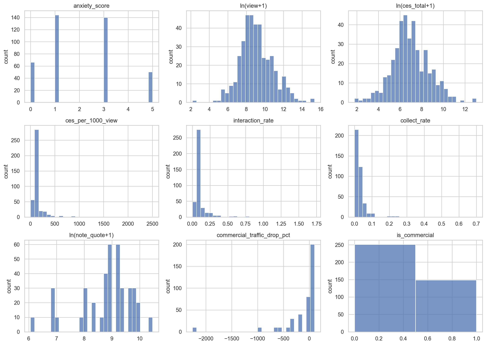
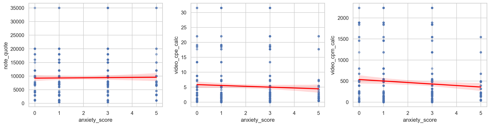

# 第一阶段：描述性统计 + 可视化

## 1. 基础描述性统计（Table 1）

统计口径：mean / std / min / max，同时附带 n、0 值计数、负值计数用于排查异常。

| variable | mean | std | min | max | n | n_zero | n_negative |
|---|---:|---:|---:|---:|---:|---:|---:|
| anxiety_score | 2.035000 | 1.581147 | 0.000000 | 5.000000 | 400 | 66 | 0 |
| view | 60635.037500 | 307481.148240 | 8.000000 | 4609000.000000 | 400 | 0 | 0 |
| ces_total | 6033.002500 | 31233.455114 | 5.000000 | 468579.000000 | 400 | 0 | 0 |
| ces_per_1000_view | 150.849476 | 193.503794 | 3.846154 | 2502.145923 | 400 | 0 | 0 |
| interaction_rate | 0.120047 | 0.135412 | 0.003307 | 1.722032 | 400 | 0 | 0 |
| collect_rate | 0.032013 | 0.050539 | 0.000000 | 0.700069 | 400 | 3 | 0 |
| note_quote | 9332.600000 | 6848.701041 | 431.000000 | 35000.000000 | 400 | 0 | 0 |
| video_cpe_calc | 5.253882 | 7.017073 | 0.000000 | 31.505986 | 400 | 10 | 0 |
| video_cpm_calc | 462.113488 | 566.534912 | 0.000000 | 2236.536053 | 400 | 10 | 0 |
| commercial_traffic_drop_pct | -121.237632 | 415.832993 | -2258.067600 | 100.000000 | 400 | 20 | 150 |

## 1.1 核心变量分布直方图

## 2. 分模块可视化

### 模块 1：焦虑情绪 → 流量效果

### 模块 2：焦虑情绪 → 商业变现

### 模块 3：商业笔记 VS 非商业笔记（流量折损）

### 模块 4：视频 VS 图文 变现性价比

### 模块 5：相关性热力图

