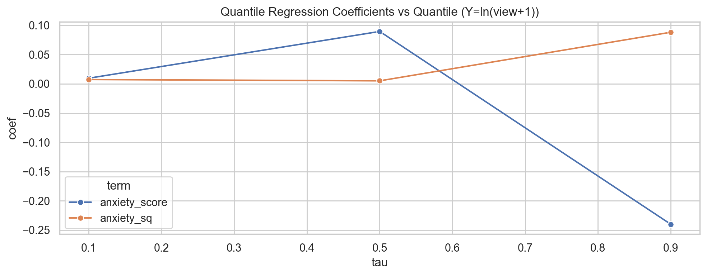
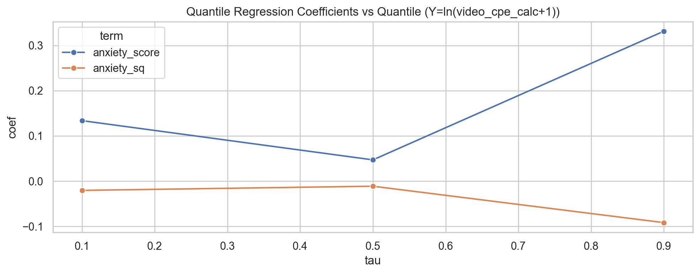
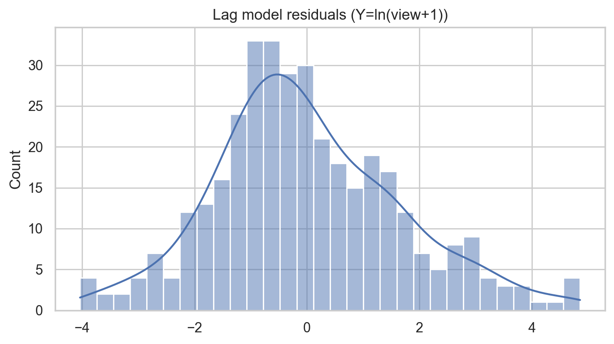
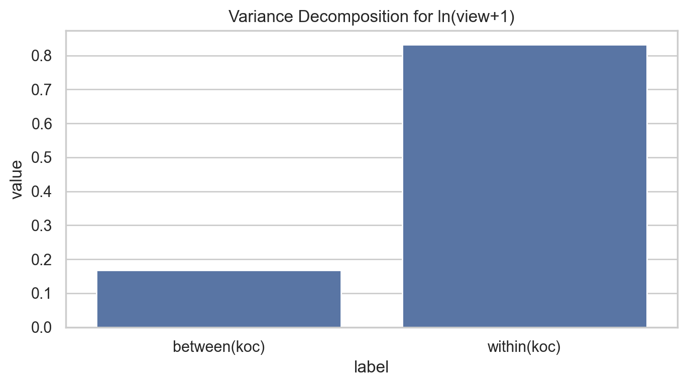
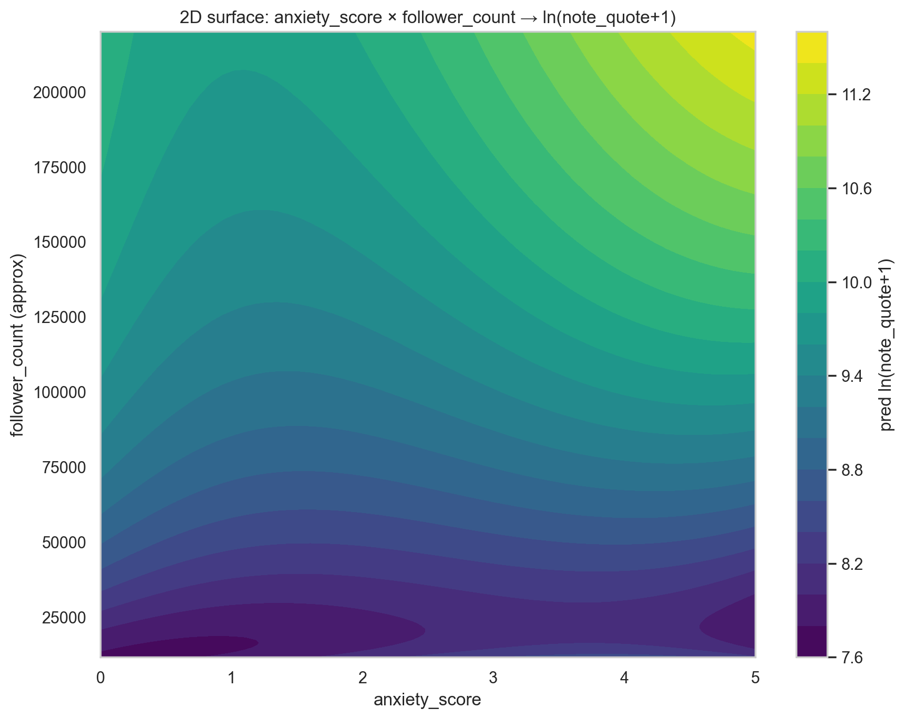

# 📊 高级统计学玩法：分位数回归 / 滞后效应 / 方差分解 / 二维曲面

数据源：`DMS001_enriched.csv`

说明：本脚本在当前环境不依赖 statsmodels，分位数回归使用线性规划求解。

## 1) 分位数回归（Quantile Regression）

- Y1：ln(view+1)
- Y2：ln(video_cpe_calc+1)
- X：anxiety_score, anxiety_score², is_commercial

- 产出：`quantile_regression_coefficients.csv`（分位数回归系数表）

## 2) 面板滞后效应分析（10 条笔记时序代理）

由于数据中没有明确的发布时间字段，本分析使用每个 `koc_id` 在 CSV 中的出现顺序作为发布顺序代理。

- 模型：ln(view+1)_t ~ lag_anxiety + lag_is_commercial + lag_ln_view + anxiety_t + is_commercial_t
- 产出：`lag_effect_model.csv`（滞后模型系数表）

## 3) 方差全分解（Variance Decomposition）

对 ln(view+1) 做方差分解：Var(Y)=Var(E[Y|koc])+E[Var(Y|koc)]，并补充 within 回归的 R2 作为解释度参考。

- 产出：`variance_decomposition_ln_view.csv`

## 4) 二维非线性曲面拟合（anxiety × follower_count）

用 3 阶多项式特征 + Ridge 回归拟合：anxiety_score × log1p(follower_count) → ln(note_quote+1)，并绘制等高线。

